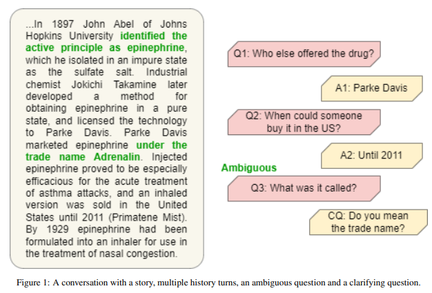

# Ask-and-ye-shall-seek

## Description

This is the code for our final project report titled [Ask and Ye Shall Seek: Generating Clarifying Questions in Closed-Domain Multi-turn Dialogues](./report.pdf) for CS685: Advanced Natural Language Processing.

In this project, we experimented with multiple strategies to ask clarifying questions to ambiguous user queries. We synthetically augment a dataset and fine-tune 7 open-source language models with changes to their training objectives. In addition, we identified four qualitative metrics that a clarification question can be evaluated upon. A substantial number of evaluations including human and automated evaluations for generations on the test set have been performed.

## Group
Rahul Seetharaman - rseetharaman@umass.edu
Rohan Lekhwani - rlekhwani@umass.edu
Aman Bansal - amanbansal@umass.edu
Shreeya Patil - shreeyadeepa@umass.edu

## Getting Around

### Data

The `data` directory contains the data used for training and testing the models.

- The `data/coqa_abg` directory contains the original [ABGCoQA dataset](https://github.com/MeiqiGuo/AKBC2021-Abg-CoQA).
- The `data/data_aug` directory contains the combined augmented data generated using GPT3.5.
- The `data/few_shot`, `data/knn_clustering`, `data/zero_shot_1` and the `data/zero_shot2` contain the data generated through Few Shot, KNN Cluster Matching and Zero Shot methods respectively.
- The `data/gptscript.py` is the script used to generate the augmented data using GPT3.5 for all methods.

### Evaluation

The `eval` directory contains files and subdirectories for automated (GPTEval) on 1722 instances and human evaluation on 560 instances.

- The `eval/GPTeval` directory contains subdirectories for BART (fine-tuned on augmented and original data) and T5 models (Canard and Canard with KL Divergence).
  - Each subdirectory contains the prediction made by the model and the corresponding score assigned by GPT3.5. The `GPTeval.py` within each subdirectory contains the code and prompt to generate scores using GPT3.5.
  - Outputs for the FLAN family of models can be found in the `flan` subdirectory along with the script to run them.
- The `eval/human_eval` directory contains rating CSVs and reference txt files for 4 human evaluators.
  - Each reference TXT file contains 10 passages along with their associated history turns and ground truth clarifying questions.
  - Each annotator CSV file contains human annotations for 560 instances. Each model generates two clarifying questions per passage leading to 14 clarifying questions by all models for a single passage.
  - The annotators were asked to rate each clarifying question on a scale of 1-5 (1 being the worst and 5 being the best) based on 4 criteria - grammatical correctness, diversity, clarity index and relevance. The annotator guidelines can be found in the `annotator_guidelines.pdf` file.
  - The `aggregated_results.json` file contains the aggregated results for all models and all annotators.
- The `eval/generate_score_template.py` file was used to generate the reference TXT files and the annotation CSV files for the human evaluation.
- The `util.py` file contains the method to aggregate the results from the human evaluation.
- The `eval/unieval.py` file was used to evaluate UniEval scores for all models.

### Metrics

The `metrics` directory contains the code for the metrics used to evaluate the models. The `metrics/evaluate_metrics.py` file contains code to calculate the BLEU, ROUGE, SacreBLEU, BERT and Vendi scores for all models based on the predictions in the `preds` directory.

### Predictions

The `preds` directory contains the predictions made by all models on the 1722 instances in the test set. Each model has the corresponding JSON file representing the the predictions made by the corresponding model.

### Miscellaneous

- The `get_data` file is used to combine both the augmented and the original data into a data structure for easy consumption by the models.
- The `inference.py` file is used to generate predictions for each model.
- The `preproc.py` script is used to preprocess data for instruction tuning a T5 model.
- The `train_model.py` file is used to fine-tune the models.
